# Creación de CRUD con lambda, Api gateway y DynamoDB

## 1. Arquitectura!

[Lab_lambda-crud](https://github.com/user-attachments/assets/d8aed8fc-fd72-4c22-a17e-c82d4ef8b737)


## 2. Definicion

Vamos a tener una aproximacion a una base de datos basica usando aws lambda empezando por el metodo POST

### 2.1 Servicios

- CloudWatch:  nos permite llevar registros en aws de lo que configuremos para la misma
- Lambda: capacidad de computo en minutos
- DynamoDB: una base de datos no relacional para usar cuando queramps
- IAM: manejador de roles permisos y accesos
- API Gateway: nos permite consumir enpoints para integrar con diferentes necesidades

### 2.2 Costo

Vamos a cancelar todos nuestros servicios entonces virtualmente no tendra costo.


Pero en capa gratuita costaria esto

https://calculator.aws/#/estimate?id=3726ecde6980b5db44627efb75d9394d4dbd7d64

## 3. Proceso

### 3.1 Creacion de lamnda

Vamos a buscar en consola algo El servicio Lamda

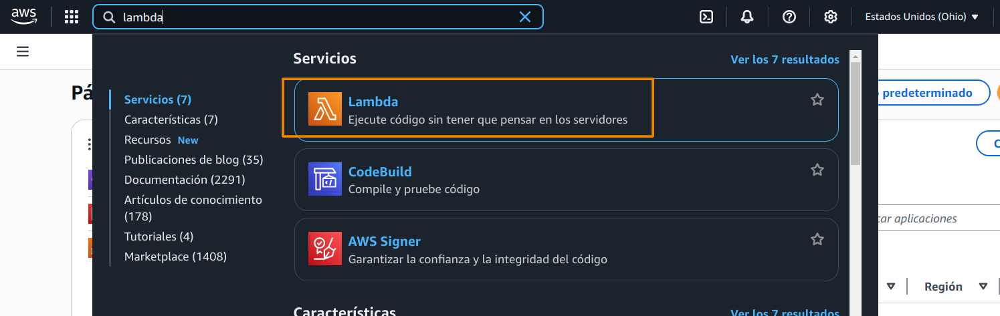

Luego vamos a crear una funcion ( lambda)

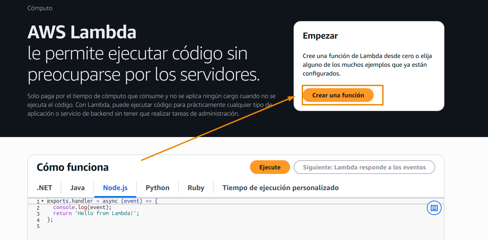


Ahora vamos a crear nuestra primera lambda y seguimos los siguientes pasos:

1. Seleccionamos crear lambda desde cero
2. Le damos un nombre a nuestra lmanda
3. Escogemos un environment 

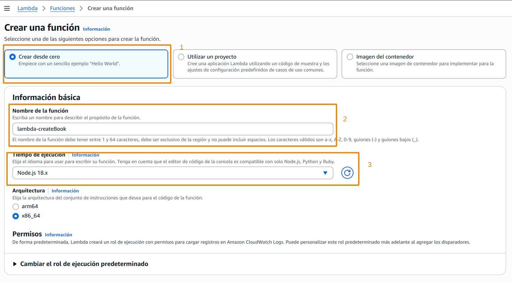

Luego clickeamos en crear funcion
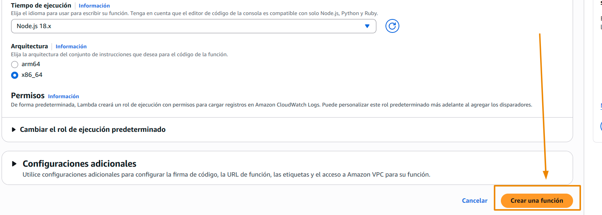


Deberiamos poder ver algo como esto


### 3.2 Disparador de Lambda

Ahora vamos a ir a la seccion trigger y vamos asignar nuestro lambda con el trigger de **API Gateway**

### 3.2 Creacion de API Gateway


Vamos a crear nuestro API gateway, esto nos permitira disparar nuestra lambda por metio de peticiones Get Put Post Delete  etc

En consola vamos a buscar el servicio API Gateway

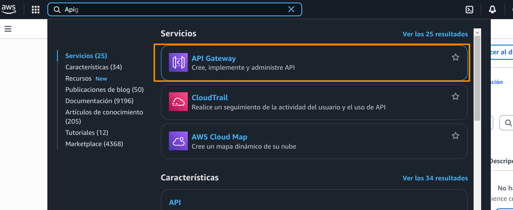


Le daremos click en crear una API

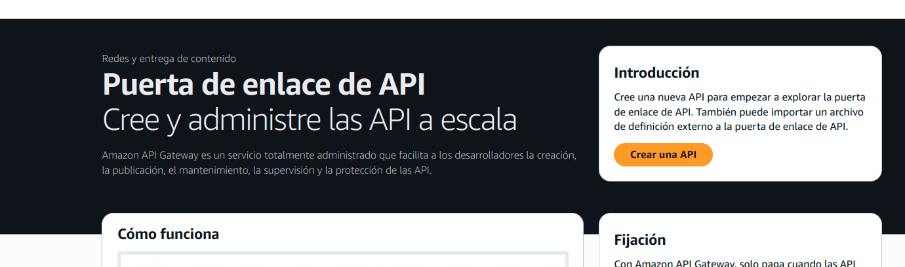


Vamos a seleccionar API http


Vamos a colocar nuestra API gateway con una integracion, que va a ser con nuestra lambda por eso seleccionamos lambda y escogemos la nuestra, le colocamos un nombre y vamos a siguiente

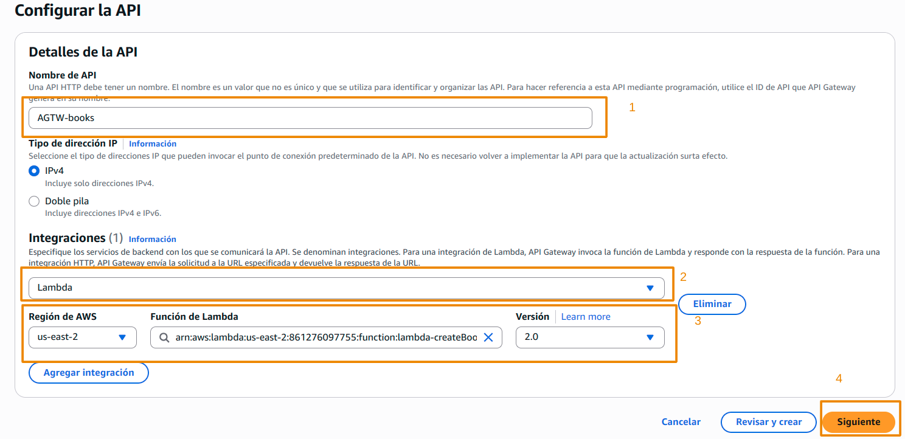


Luego escogemos la accion  que sera **post** y  la ruta que sera la siguiente */books*, y escogemos en target a nuestra lambda creada


Dejamos los stages en **$default**

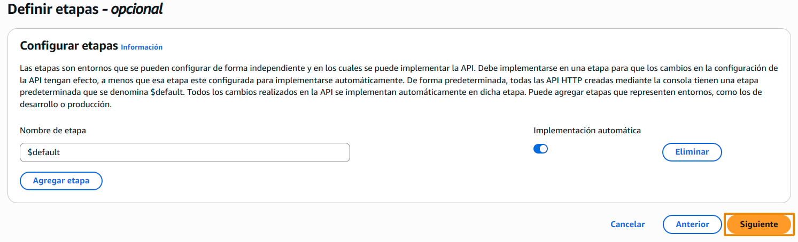

Y luego le damos click a crear

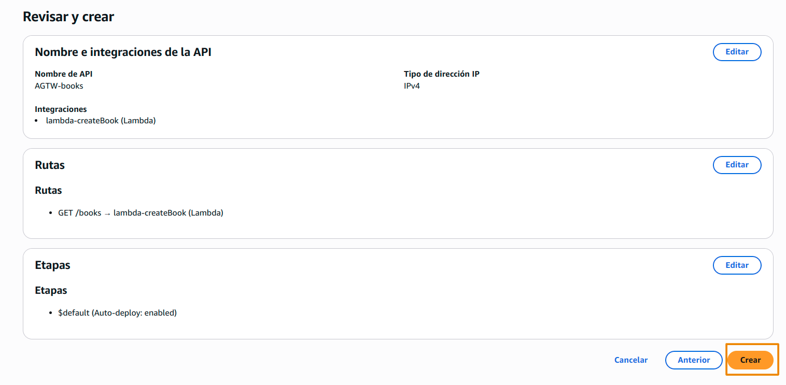

Ahora podemos ver nuestra API http con  su url de invocacion y sus rutas definidas tambien


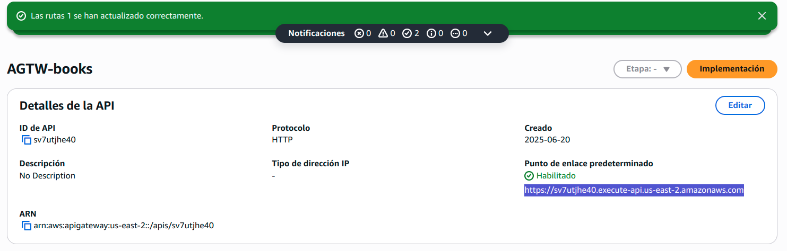


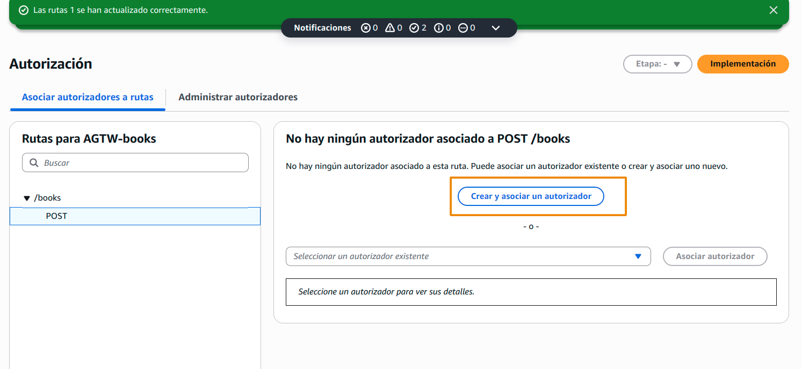


Tambien podemos colocar una url por diferente con nuestros dominios en custom domain names


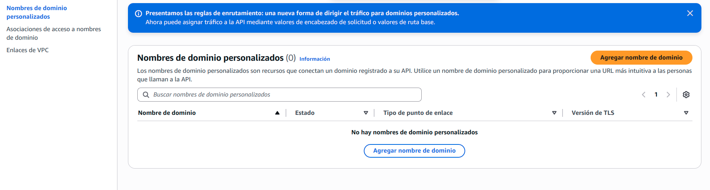


### 3.3 Pruebas de API

Vamos a probar nuestra API, podemos hacerlo de muchas formas, con postman, imsonia, etc


Vamos a hacerlo con Postman

colocamos nuestra ulr base, la nueva ruta y probamos

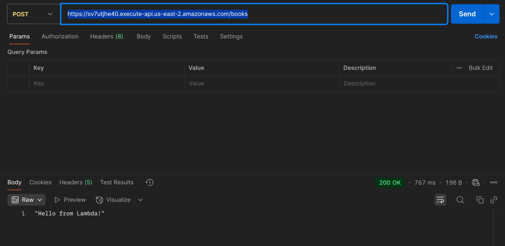


como vemos esta funcionando


### 3.4 Creacion de Base de Datos

Vamos a crear la base de datos la cual estariamos modificando con nuestras APIS

En consola vamos a buscar el servicio **Dynamo DB**, Dynamo DB es una base de datos no relacional es muy flexible, precisamente lo que necesitamos para este laboratorio

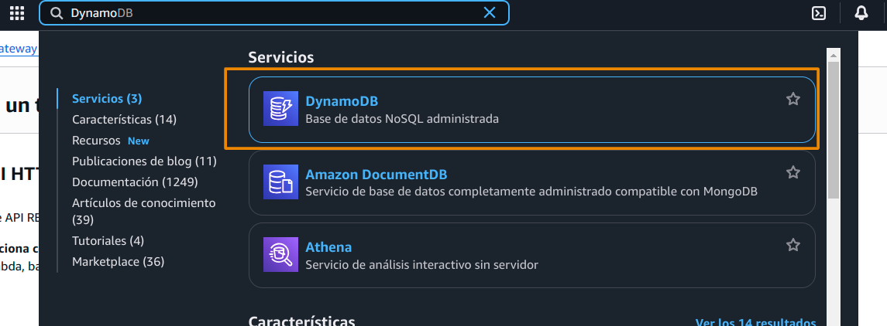


En el servicio le daremos click
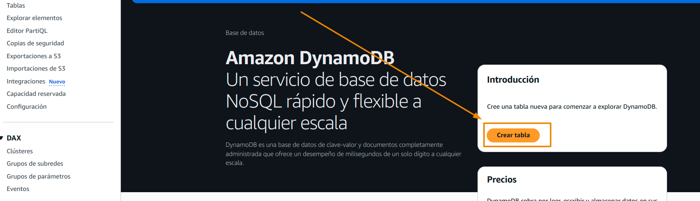


Crearemos una tabla con la siguiente configuracion;

1. nombre de la tabla *books*
2. Clave para la tabla *id* o en su caso tipo **string** (cadena)


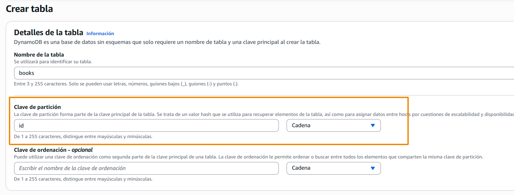


Le daremos click sin modificar nada más para crear nuestra tabla

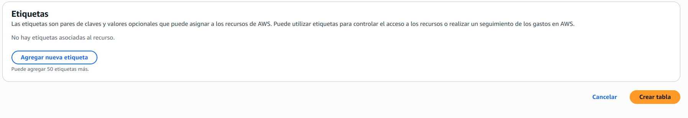


Veremos algo como lo siguiente (puede tardar algunos segundos en la creación)


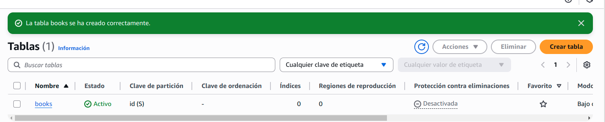


### 3.5 Modificacion tabla base de datos

En la base de datos

Ahora vamos a modificar nuestra peticion para agregar valores a nuestra base de datos, agregamos el siguiente objeto en su body


```
  {
    "title":"Aws lambdas",
    "author": "Santiago Sanchez"
  }
```
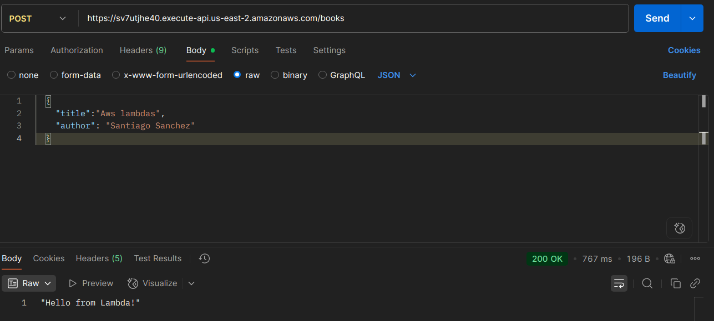

y vamos a modificar nuestra lambda para confirmar que funciona

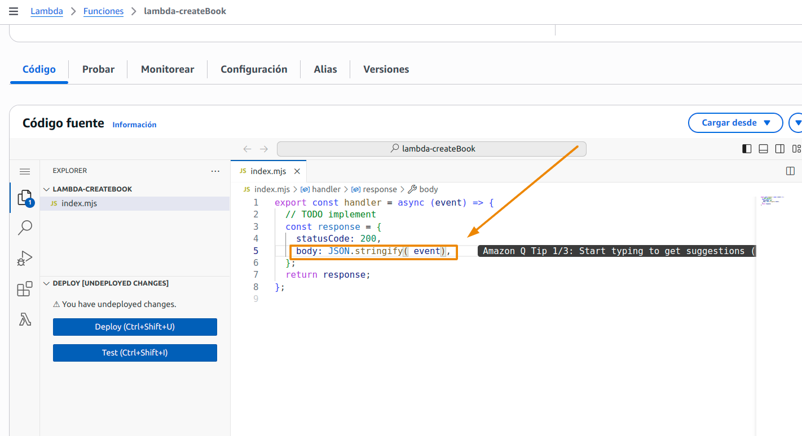

Y comprobaremos que en lamnda en el event, venga esa informacion confirmando un **body**

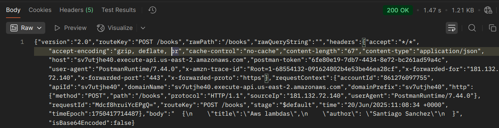


Ahora modificaremos el codigo del lambda para poder agregar un valor cuando nos llegue


```
import { DynamoDBClient } from "@aws-sdk/client-dynamodb";
import { DynamoDBDocumentClient, PutCommand } from "@aws-sdk/lib-dynamodb";
import { randomUUID } from "crypto";

const ddbDocClient = DynamoDBDocumentClient.from(new DynamoDBClient({ region: "us-east-1" }));

export const handler = async (event, context) => {
  try {
    const book = JSON.parse(event.body);

    const newBook = {
      ...book,
      id: randomUUID(),
    };
    
    await ddbDocClient.send(new PutCommand({
      TableName: "books",
      Item: newBook,
    }));

    return {
      statusCode: 201,
      body: JSON.stringify(newBook),
    };
  } catch (error) {
    console.error(error);
    return {
      statusCode: 500,
      body: JSON.stringify({ message: error.message }),
    };
  }
};


```

El codigo anterior nos permitira modificar nuestra base de datos con un post... si tuvieramos permisos, como se ve en la siguiente imagen, vamos a modificarlos

### 3.6 Permisos y Logs

Ahora  nos falta un permiso..., pero antes de eso, donde vemos los logs? los errores?

Pues vamos a **cloud Watch** en consola

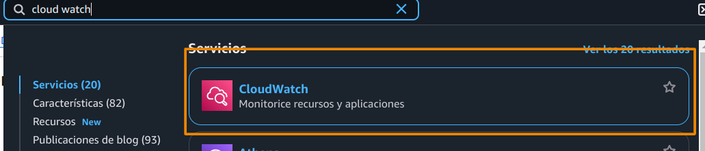

Vamos a registros y grupos de registros (logs groups)


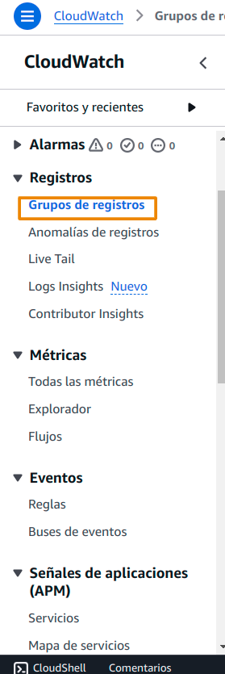

Aca podemos ver el error que tenemos


Ahora en cuanto a permisos debemos ir a nuestro lambda, la pestaña de configuracion y permisos

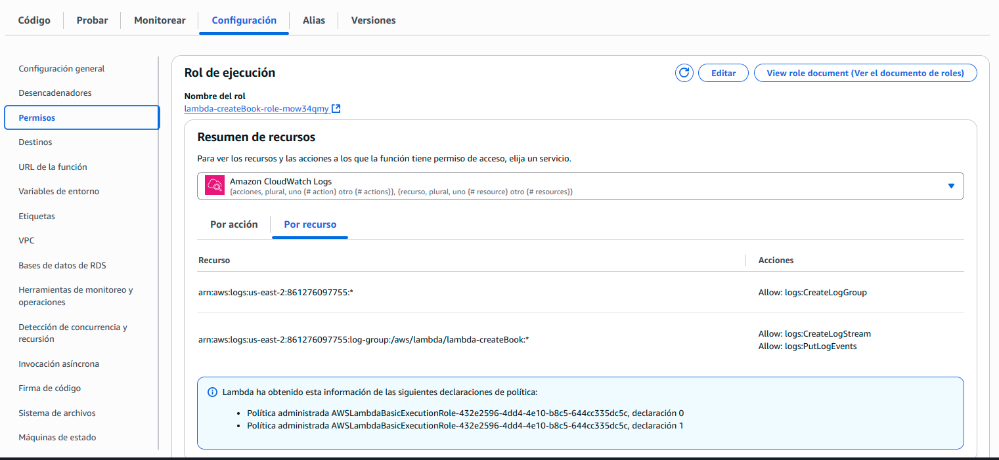

Vamos a ir a nuestro rol y le damos click

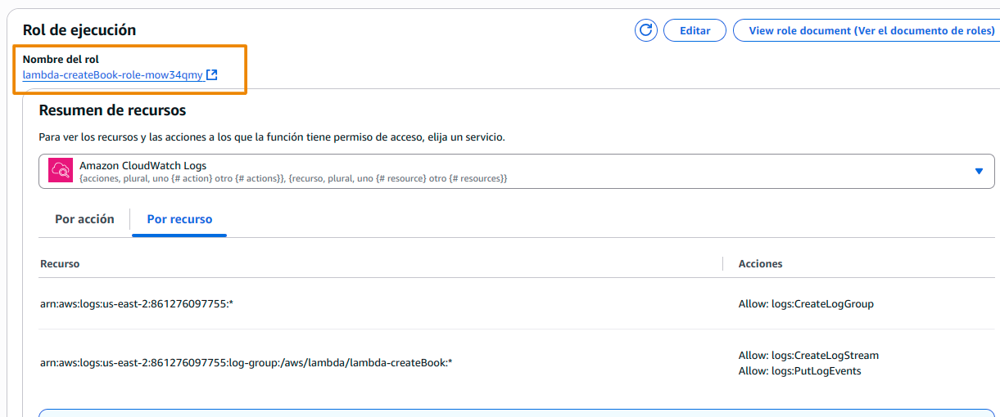


Ya en nuestro rol vamos primero a mirar los permisos y luego a agregar un permiso(policy)
Vamos a crear una nueva politica de permisos (principio de minimo acceso) en el Servicio de **IAM** y en Politicas vamos a crear una nueva


Vamos a escoger el servicio y los permisos y donde aplicarian y por ultimo vamos a agregar el ARN de nuestra tabla


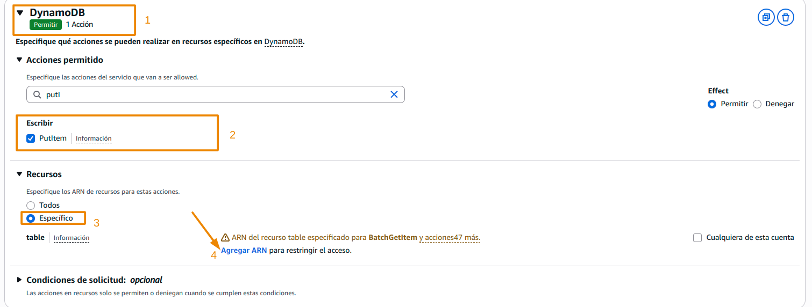

En ARN nos traeremos el ARN de nuestra tabla en dynamo (navegamos a ella en otra pestaña) y los campos se ajustaran solos

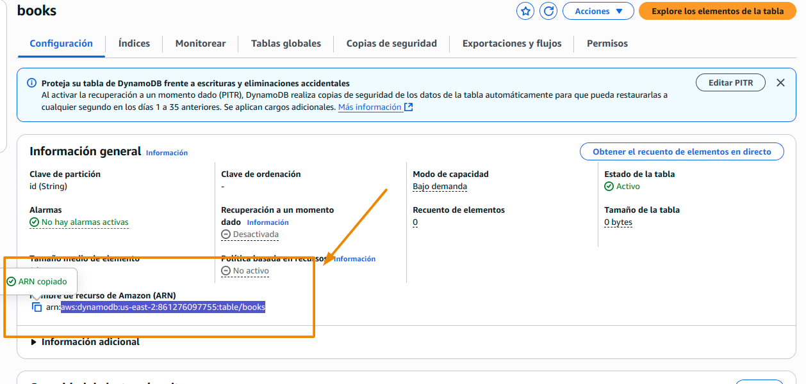

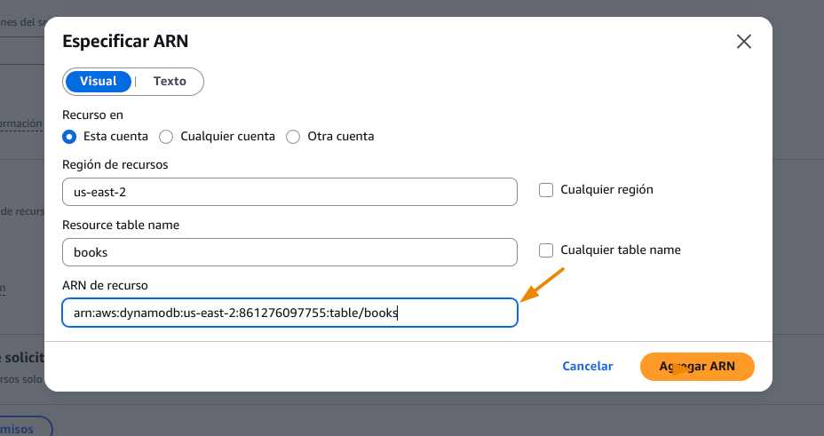


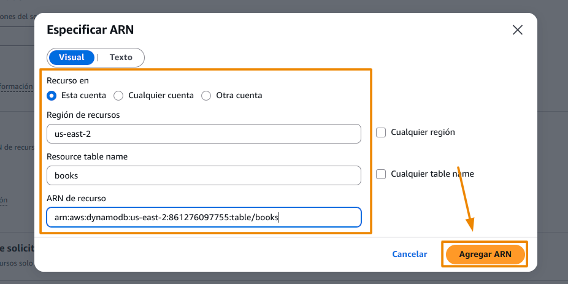


Le damos en agregar y luego en el panel del permiso clickeamos siguiente

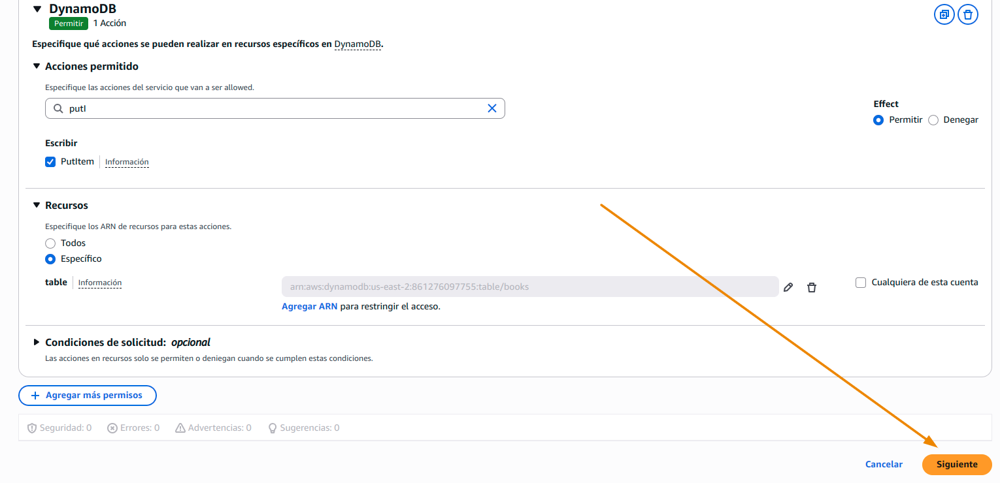


Ahora colocaremos un nombre a la policy *CreateBookPolicy* y  crearemos el book policy

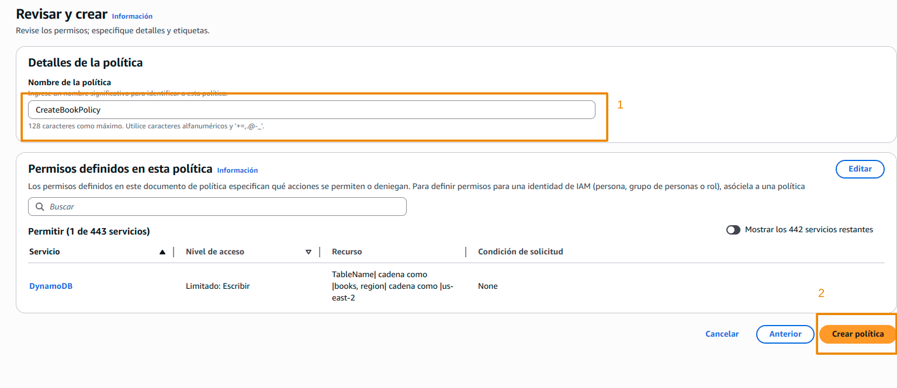


Luego la ligaremos a nuestro policy , buscaremos, colocamos si nombre, la agregamos 


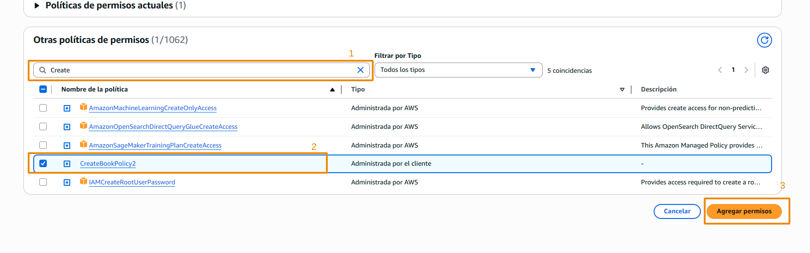


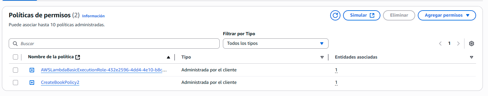

ahora probamos en postman


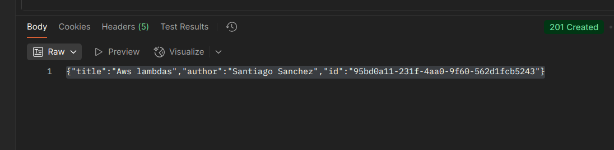


Vamos a nuestra tabla


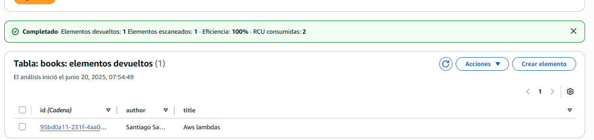


Y buala tenemos nuestra primera operacion en nuestra base de datos!


## 4. Eliminación


### 4.1 Tabla
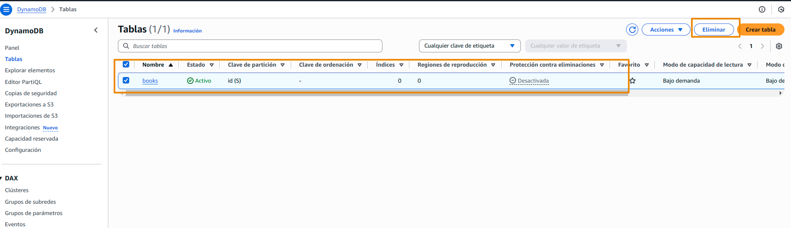
### 4.2 Lambda
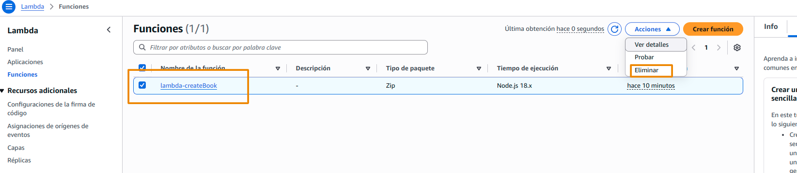


### 4.3 API Gateway

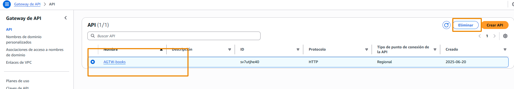


### 4.4 CloudWatch Log groups


### 4.5 (Opcional) Eliminamos las politicas

Es opcional por que las politicas de IAM no tienen costo


