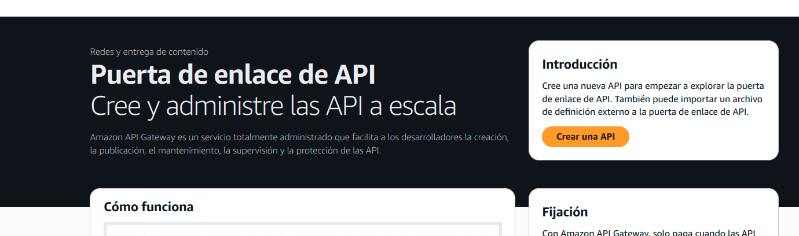

# Creación de CRUD con lambda, Api gateway y DynamoDB

## 1. Arquitectura

## 2. Definicion

### 2.1 Servicios

### 2.2 Costo

## 3. Proceso

### 3.1 Creacion de lamnda

Vamos a buscar en consola algo El servicio Lamda


Luego vamos a crear una funcion ( lambda)


Ahora vamos a crear nuestra primera lambda y seguimos los siguientes pasos:

1. Seleccionamos crear lambda desde cero
2. Le damos un nombre a nuestra lmanda
3. Escogemos un environment 


Luego clickeamos en crear funcion


Deberiamos poder ver algo como esto


### 3.2 Disparador de Lambda

Ahora vamos a ir a la seccion trigger y vamos asignar nuestro lambda con el trigger de **API Gateway**

### 3.2 Creacion de API Gateway


Vamos a crear nuestro API gateway, esto nos permitira disparar nuestra lambda por metio de peticiones Get Put Post Delete  etc

En consola vamos a buscar el servicio API Gateway


Le daremos click en crear una API


Vamos a seleccionar API http




Ahora vamos a escoger la integracion, que va a ser con nuestra lambda por eso seleccionamos lambda y escogemos la nuestra


#### Imagen opciones lamnda

Luego escogemos la accion  que sera **post** y  la ruta que sera la siguiente */books*, y escogemos en target a nuestra lambda creada

#### imagen opciones lamnda 2


Dejamos los stages en **$default**

### imagen default stage

Y luego le damos click a crear


Ahora podemos ver nuestra API http con  su url de invocacion y sus rutas definidas tambien


### imagen url lmanda


### imagen ruta y attach autorize


Tambien podemos colocar una url por diferente con nuestros dominios en custom domain names


### imagen custom con domain names


### 3.3 Pruebas de API

Vamos a probar nuestra API, podemos hacerlo de muchas formas, con postman, imsonia, etc


Pero la vamos a probar usando el fetch nativo en consola para confirmar su funcionamiento base, 

Vamos a ir a un navegador, abrir la consola de desarrollador y ejecutar el siguiente codigo
```

fetch()
```


#### imagen post usando fetch a Aws api gateway


### 3.4 Creacion de Base de Datos

Vamos a crear la base de datos la cual estariamos modificando con nuestras APIS

En consola vamos a buscar el servicio **Dynamo DB**, Dynamo DB es una base de datos no relacional es muy flexible, precisamente lo que necesitamos para este laboratorio


En el servicio le daremos click


Crearemos una tabla con la siguiente configuracion;

1. nombre de la tabla *books*
2. Clave para la tabla *id* o en su caso tipo **string** (cadena)


Le daremos click sin modificar nada más para crear nuestra tabla


Veremos algo como lo siguiente (puede tardar algunos segundos en la creación)


### 3.5 Modificacion tabla base de datos

En la base de datos

Ahora vamos a modificar nuestra peticion fetch para agregar valores a nuestra base de datos


```

fetch()
```


Y comprobaremos que en lamnda en el event, venga esa informacion


#### imagen retorno lambda


Ahora modificaremos el codigo del lambda para poder agregar un valor cuando nos llegue


```
import { DynamoDBClient } from "@aws-sdk/client-dynamodb";
import { DynamoDBDocumentClient, PutCommand } from "@aws-sdk/lib-dynamodb";
import { randomUUID } from "crypto";

const ddbDocClient = DynamoDBDocumentClient.from(new DynamoDBClient({ region: "us-east-1" }));

export const handler = async (event, context) => {
  try {
    const book = JSON.parse(event.body);

    const newBook = {
      ...book,
      id: randomUUID(),
    };
    
    await ddbDocClient.send(new PutCommand({
      TableName: "books",
      Item: newBook,
    }));

    return {
      statusCode: 201,
      body: JSON.stringify(newBook),
    };
  } catch (error) {
    console.error(error);
    return {
      statusCode: 500,
      body: JSON.stringify({ message: error.message }),
    };
  }
};


```


El codigo anterior nos permitira modificar nuestra base de datos con un post

### 3.6 Permisos y Logs

Ahora  nos falta un permiso..., pero antes de eso, donde vemos los logs? los errores?

Pues vamos a **cloud Watch** en consola


Vamos a registros y grupos de registros (logs groups)


Aca podemos ver el error que tenemos


Ahora en cuanto a permisos debemos ir a nuestro lambda

aca podemos ver su rol

#### imagen rol  lambda
## 4. Eliminación