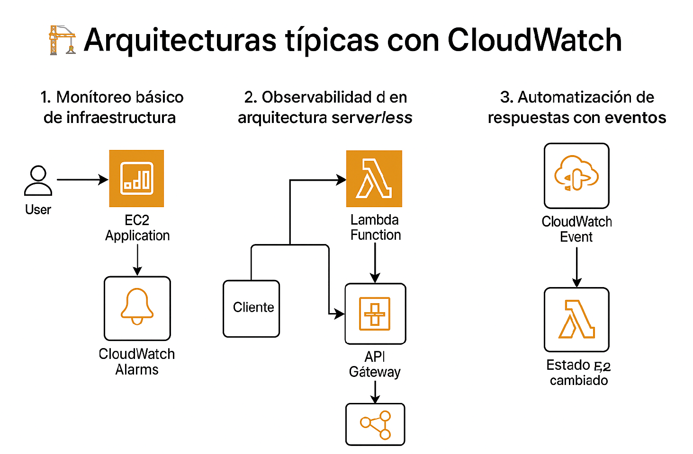

# 📊 Amazon CloudWatch

 Es el servicio de monitoreo de AWS que  nos permite recopilar, visualizar y actuar en tiempo real si es necesario, nos ayuda recolentando métricas, registros (logs) y eventos de recursos de AWS y aplicaciones personalizadas.


## Preguntas que puedes resolver con cloud watch

- ¿Cómo se ve el tráfico del sitio web?

- ¿Cómo está el rendimiento?

- ¿Cuánto ancho de banda está usando mi aplicación?

- ¿Están optimizados los recursos de cómputo?

## Características generales (entre muchas)

| Característica            | Descripción                                                                 |
|---------------------------|-----------------------------------------------------------------------------|
| 📈 **Monitoreo de métricas** | Se pueden monitorear métricas predefinidas de servicios AWS (EC2, RDS, Lambda, etc.) y métricas personalizadas. |
| 📄 **Logs**               | Nos permite recolectar, almacenar y analizar logs desde EC2, Lambda, aplicaciones on-premise, etc. |
| ⏰ **Alarmas**            | Nos permite setear alarmas para actuar ante ciertos umbrales de métricas (enviar notificaciones, ejecutar funciones Lambda, etc.). |
| 📅 **Dashboards**         | Podemos crear dashboards visuales en tiempo real para monitorear recursos y aplicaciones. |
| ⚡ **Eventos**            | Detecta cambios en el estado de recursos mediante CloudWatch Events (EventBridge). |

---

## Arquitecturas geberales con CloudWatch

1. **Monitoreo básico de infraestructura** : Monitoreo de logs y métricas desde EC2, generación de alertas automáticas por CPU alta.

2. **Observabilidad en arquitectura serverless** : Captura de errores y tiempos de ejecución en funciones Lambda.

3. **Automatización de respuestas con eventos** : Si una instancia EC2 entra en estado "stopped", CloudWatch puede lanzar una función Lambda que la reinicie.



## Algoritmo Ejemplo para alarma

```bash
aws cloudwatch put-metric-alarm \
  --alarm-name "HighCPU" \
  --metric-name CPUUtilization \
  --namespace AWS/EC2 \
  --statistic Average \
  --period 300 \
  --threshold 80 \
  --comparison-operator GreaterThanThreshold \
  --dimensions Name=InstanceId,Value=i-1234567890abcdef0 \
  --evaluation-periods 1 \
  --alarm-actions arn:aws:sns:us-west-2:111122223333:MyTopic
  ```


## Consideraciones

### Caracteristicas positivas
- Integración nativa con todos los servicios AWS.

- Escalable automáticamente sin configuración adicional.

- Permite automatizar respuestas a eventos del sistema.

- Soporta métricas y logs personalizados.

- Dashboards centralizados para toda la arquitectura.

### Importante a tener en cuenta

- Los precios pueden crecer rápidamente si se generan muchos logs sin filtros adecuados.

- Para aplicaciones híbridas (on-premise + AWS) se debe configurar el agente de logs manualmente.

- No es una solución de APM completa como Datadog o New Relic, aunque se integra con ellas.

## Costo
Con cloud Watch podemos tener mucha informacion para una capa gratuita:

- NameSpaces para separar metricas de forma logica
- Crear una alarma que se dispare si el uso de CPU de una instancia EC2 supera el 70%.
- Enviar una notificación por correo vía SNS si una función Lambda lanza muchos errores.
- Construir maximo 3 dashboards para visualizar métricas 
- Configurar un evento que detecte cuando una instancia EC2 cambia de estado y dispare una función Lambda para reiniciarla o enviar una alerta.


[Consulta más aca](https://aws.amazon.com/es/cloudwatch/pricing/)

## Laboratorio

### Arquitectura 