# Amazon CloudWatch


Es el servicio de monitoreo de AWS que  nos permite recopilar, visualizar y actuar en tiempo real si es necesario, nos ayuda recolentando métricas, registros (logs) y eventos de recursos de AWS y aplicaciones personalizadas.


## Preguntas que puedes resolver con cloud watch

- ¿Cómo se ve el tráfico del sitio web?

- ¿Cómo está el rendimiento?

- ¿Cuánto ancho de banda está usando mi aplicación?

- ¿Están optimizados los recursos de cómputo?

## Características generales (entre muchas)


| Característica            | Descripción                                                                 |
|---------------------------|-----------------------------------------------------------------------------|
| 📈 **Monitoreo de métricas** | Se pueden monitorear métricas predefinidas de servicios AWS (EC2, RDS, Lambda, etc.) y métricas personalizadas. |
| 📄 **Logs**               | Nos permite recolectar, almacenar y analizar logs desde EC2, Lambda, aplicaciones on-premise, etc. |
| ⏰ **Alarmas**            | Nos permite setear alarmas para actuar ante ciertos umbrales de métricas (enviar notificaciones, ejecutar funciones Lambda, etc.). |
| 📅 **Dashboards**         | Podemos crear dashboards visuales en tiempo real para monitorear recursos y aplicaciones. |
| ⚡ **Eventos**            | Detecta cambios en el estado de recursos mediante CloudWatch Events (EventBridge). |

---

## Arquitecturas geberales con CloudWatch

1. **Monitoreo básico de infraestructura** : Monitoreo de logs y métricas desde EC2, generación de alertas automáticas por CPU alta.

2. **Observabilidad en arquitectura serverless** : Captura de errores y tiempos de ejecución en funciones Lambda.

3. **Automatización de respuestas con eventos** : Si una instancia EC2 entra en estado "stopped", CloudWatch puede lanzar una función Lambda que la reinicie.


## Algoritmo Ejemplo para alarma

```bash
aws cloudwatch put-metric-alarm \
  --alarm-name "HighCPU" \
  --metric-name CPUUtilization \
  --namespace AWS/EC2 \
  --statistic Average \
  --period 300 \
  --threshold 80 \
  --comparison-operator GreaterThanThreshold \
  --dimensions Name=InstanceId,Value=i-1234567890abcdef0 \
  --evaluation-periods 1 \
  --alarm-actions arn:aws:sns:us-west-2:111122223333:MyTopic
  ```


## Consideraciones

### Caracteristicas positivas
- Integración nativa con todos los servicios AWS.

- Escalable automáticamente sin configuración adicional.

- Permite automatizar respuestas a eventos del sistema.

- Soporta métricas y logs personalizados.

- Dashboards centralizados para toda la arquitectura.

### Importante a tener en cuenta

- Los precios pueden crecer rápidamente si se generan muchos logs sin filtros adecuados.

- Para aplicaciones híbridas (on-premise + AWS) se debe configurar el agente de logs manualmente.

- No es una solución de APM completa como Datadog o New Relic, aunque se integra con ellas.

## Costo
Con cloud Watch podemos tener mucha informacion para una capa gratuita:

- NameSpaces para separar metricas de forma logica
- Crear una alarma que se dispare si el uso de CPU de una instancia EC2 supera el 70%.
- Enviar una notificación por correo vía SNS si una función Lambda lanza muchos errores.
- Construir maximo 3 dashboards para visualizar métricas 
- Configurar un evento que detecte cuando una instancia EC2 cambia de estado y dispare una función Lambda para reiniciarla o enviar una alerta.


[Cohttps://catalog.workshops.aws/general-immersionday/en-US/basic-modules/40-monitoring/monitoringnsulta más aca](https://aws.amazon.com/es/cloudwatch/pricing/)

## Laboratorio

### Arquitectura 
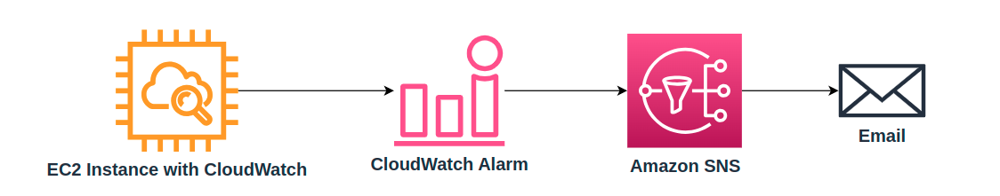

### Costo:

  - Amazon CloudWatch: 
    - Recopilación : $0.50 por GB
    - Almacenamiento: $0.03 por GB
    - Métricas: $0.03 por mes

  - Amazon EC2 - t2.micro: $0.0116 por hora

  - Amazon EBS - SSD general (gp2): $0.10 por GB-mes 

  - Amazon SNS - Correo electrónico/Correo electrónico en formato JSON: $2.00 por cada 100,000 notificaciones

  Costo total : $0.5 - $1.00 USD -> **$2,000 - $4,000 pesos colombianos** aprox.

### Proceso

#### SNS
Vamos a crear un SNS para mensajeria

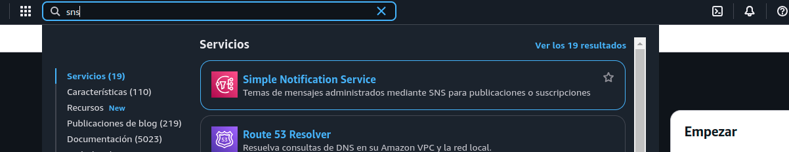

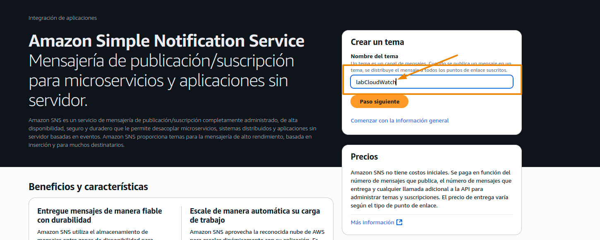

1. colocaremos el nombre del tema para el sns  _labCloudWatch_
2. escogeremos la version standar
3. colocaremos una descripcion para el sns


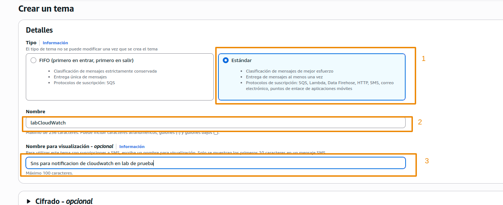

Lo crearemos
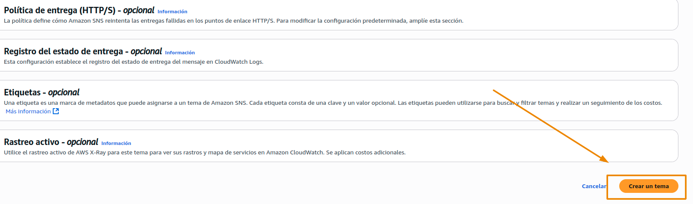

Aparecera un mensaje como el siguiente

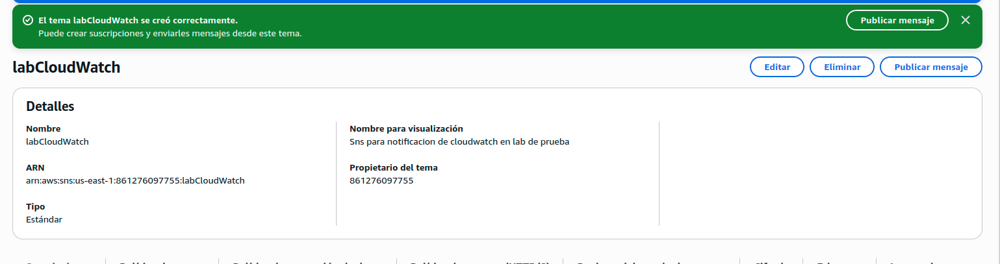


ahora crearemos una subscripcion 


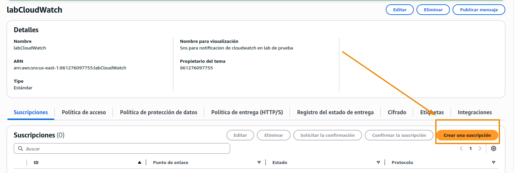

Vamos a colocar como protocolo email o correo electronico y el correo al cual queremos que llegue la notificacion y luego crearemos la subscripcion


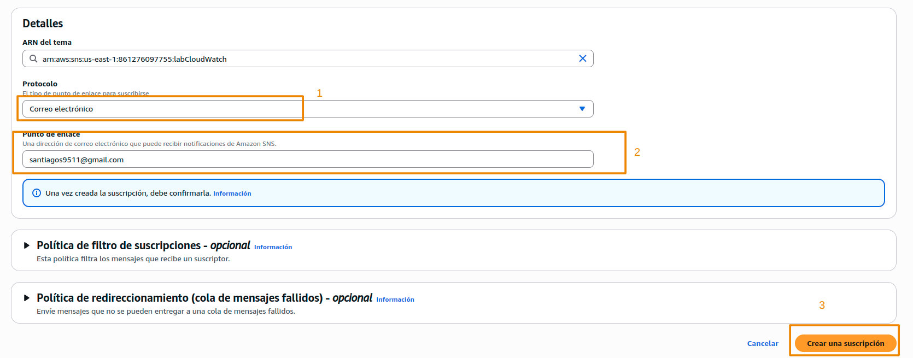

con esto llegara un email para confirmar las notificaciones del sns


con esto creamos nuestro sns


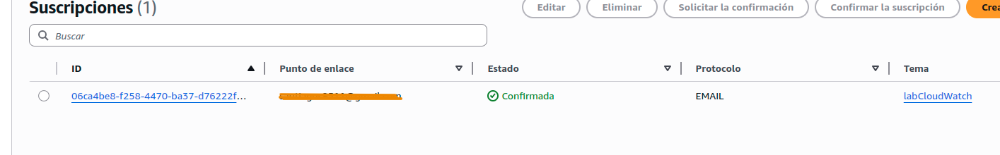

#### EC2

Ahora crearemos nuestro EC2, iremos a nuestra consola de Ec2 y lanzaremos una nueva instancia:
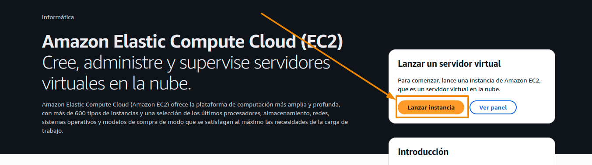

Le colocaremos de nombre  _labCloudWatch_

Escogeremos las opciones de la capa gratuita, que deberian estar por defecto, amazon linux e instancia t2.micro

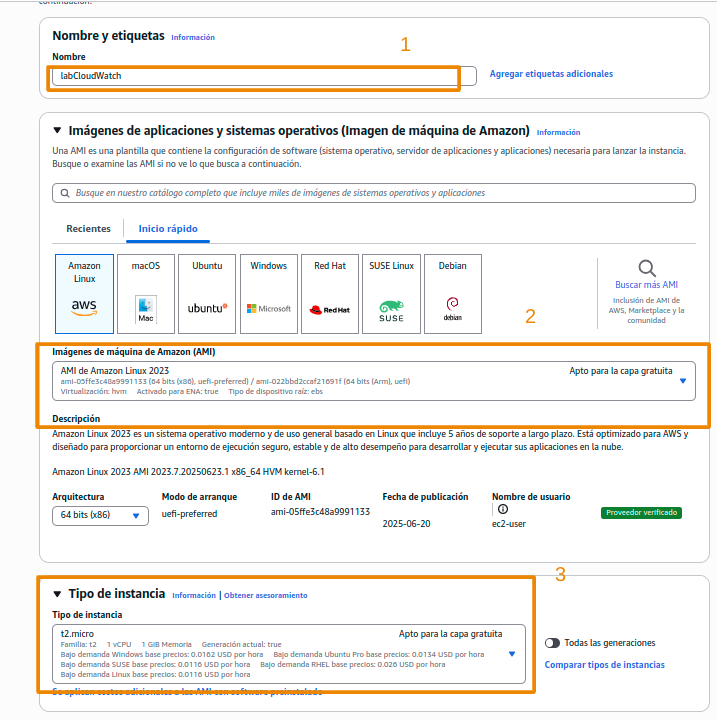

Luego en la seccion de red escogeremos crear un grupo de seguridad y marcaremos las opciones de red que estan disponibles

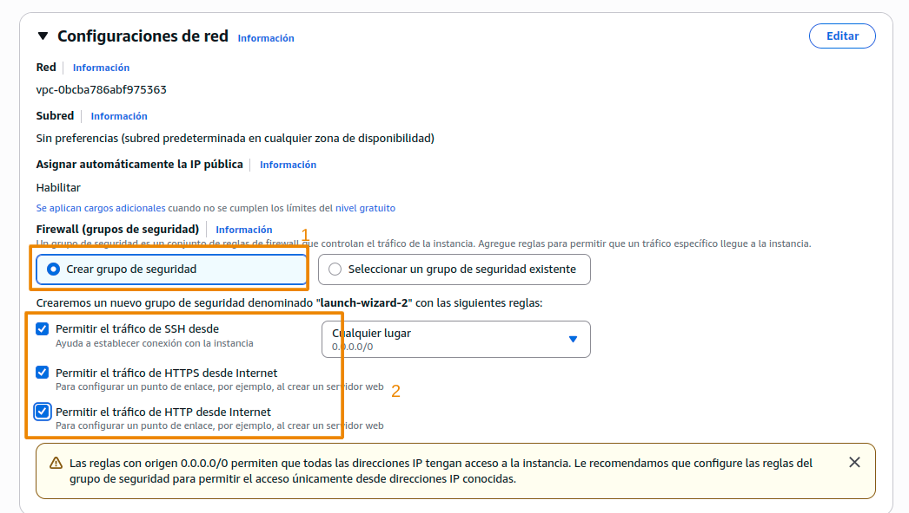

ahora abriremos la pestaña de detalles avanzados iremos al final 
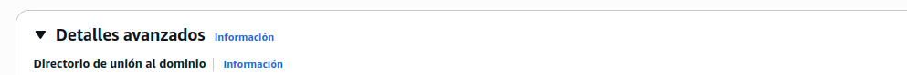
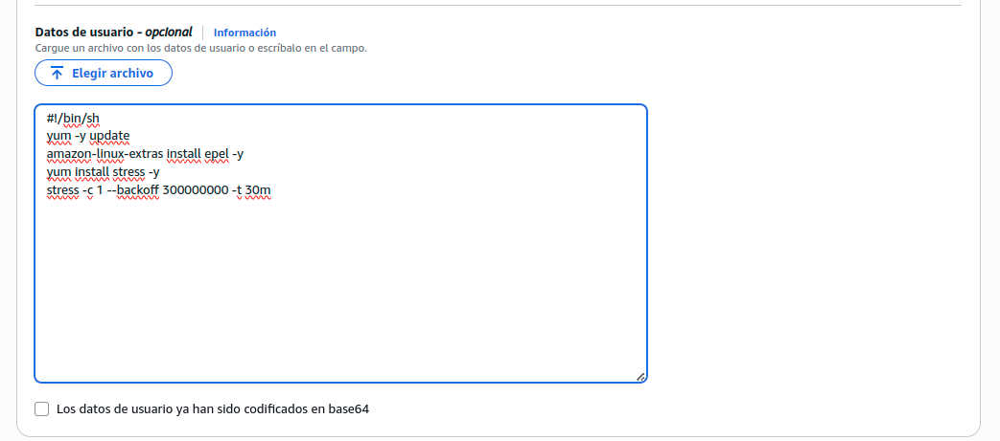

y pegaremos el siguiente script

> [!CAUTION]
> El siguiente es un script de estres lo que puede forzar la ejecucion de la instancia por lo mismo debemos hacerlo con cuidado y eliminar esta instancia al final del lab

el siguiente script de estrés se usa para simular un worker o un hilo de trabajo con un tiempo de ejecución de 300000000 microsegundos o 5 minutos durante 30 minutos.

```
#!/bin/sh 
yum -y update
amazon-linux-extras install epel -y
yum install stress -y
stress -c 1 --backoff 300000000 -t 30m
```

en la parte derecha revisamos el resumen y lanzamos la instancia

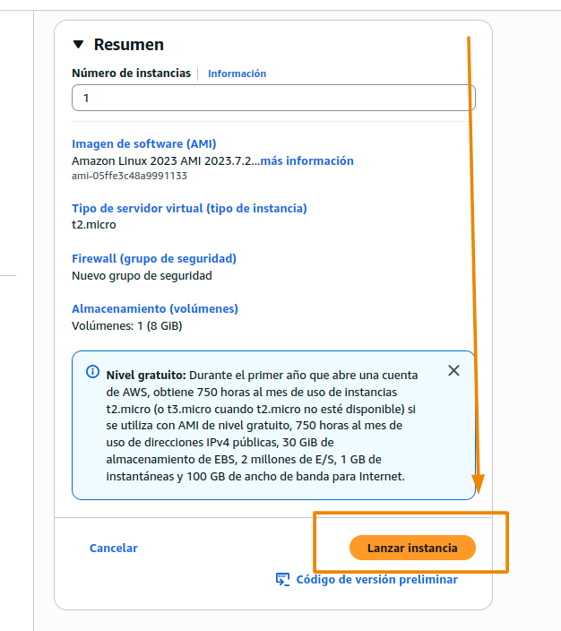


nos solicitara un configuracion de claves par, seleccionaremos continuar sin claves par

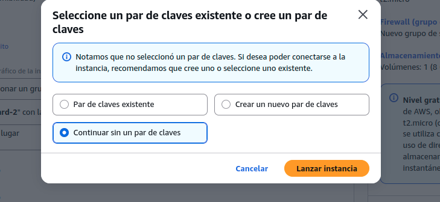

ahora en intancias podemos ver nuestra instancia

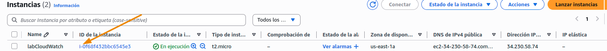

#### CloudWatch

Ahora crearemos nuestro cloud Watch

Seleccionaremos nuestra instancia recien creada e iremos a acciones, aqui seleccionaremos la opcion de monitoreo y solución de problemas y en esta opcion, la de administrar el monitoreo detallado

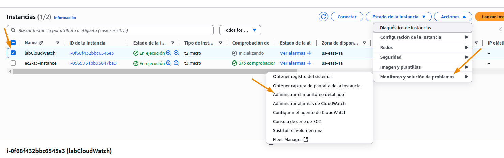

Aca nos informa que el monitoreo detallado se hace en para la instancia cada minuto y lo seleccionaremos y lo confirmaremos
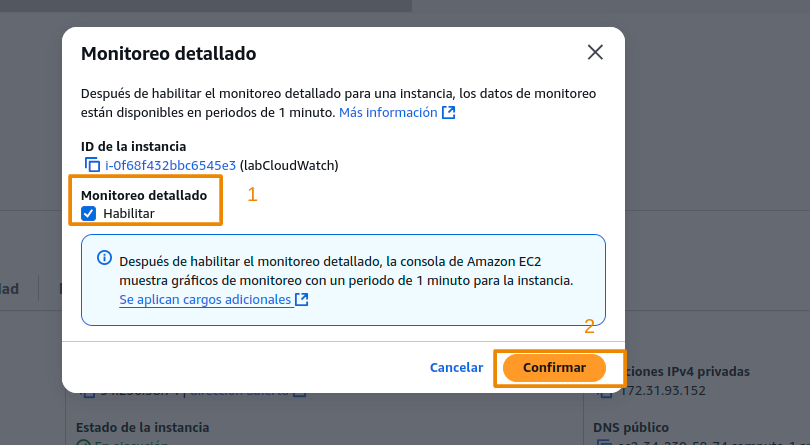


Ahora en los detalles de nuestra instancia copiaremos la id de la misma

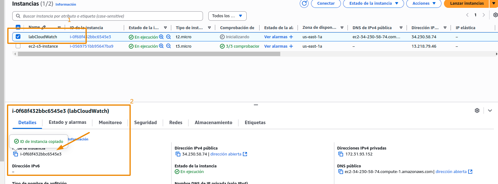

ahora en las acciones de la instancia iremos nuevamente a la accion de monitoreo y seleccionaremos administrar alarmas de cloudWatch
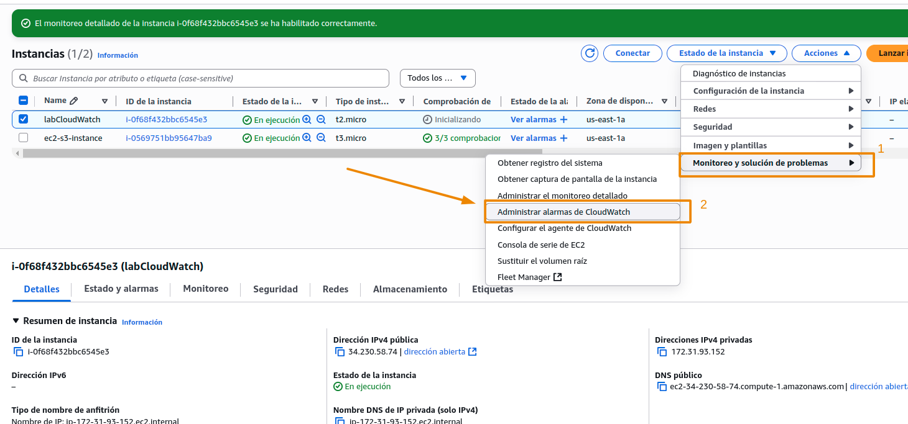


Seleccionaremos crear alarma y escogeremos nuestro ec2

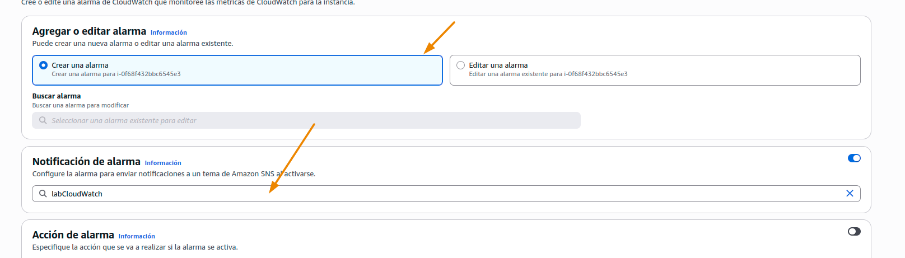

y en los valores de limite colocaremos los siguientes


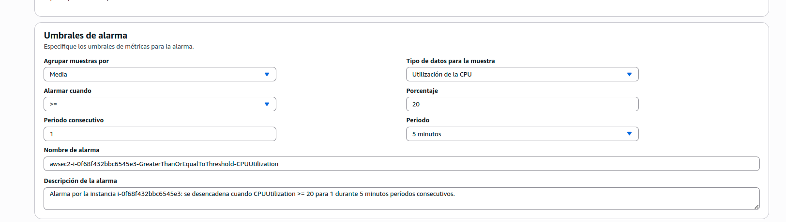

Le daremos click en crear
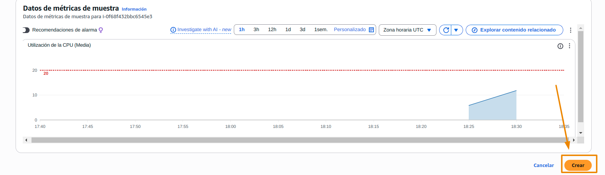

Ahora buscaremos cloudwatch en la consola de servicios, nos iremos  a todas las alarmas  y veremos que nuestro ec2 marca alarma


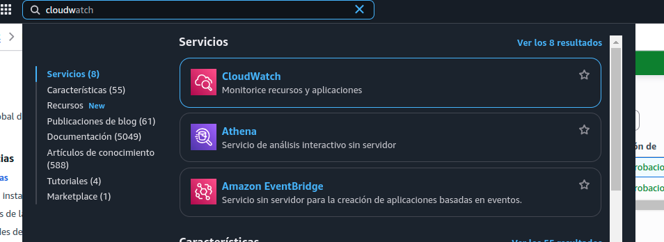


En esta misma seccion nos iremos a Metricas, dentro de metricas a todas las metricas y colocaremos el id de nuestra instancia

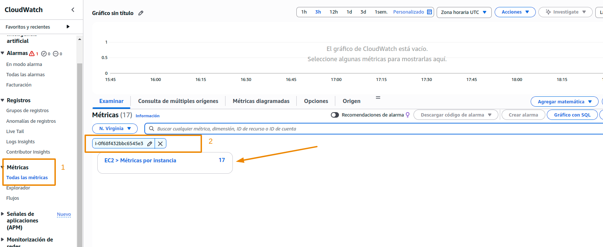

aca veremos todas las metricas que se tienen, cuales tienen alarma y si se quiere colocar un nombre al tablero

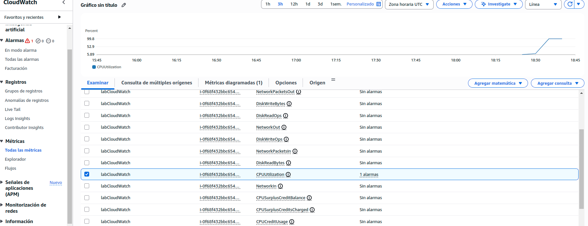


En esta consola podemos ver toda la informacion que hayamos programado para seguimiento

### Eliminacion de recursos

Debemos borrar lo siguiente y estar seguros que se eliminaron:
- Alarma de CloudWatch 
- Instancia EC2 
- Tema de SNS

#### En CloudWatch 

iremos a todas las alarmas la selecionaremos y la eliminaremos

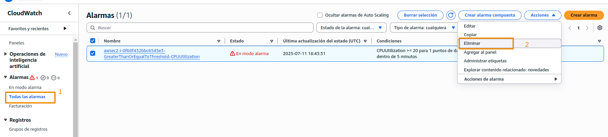

#### En EC2 

vamos a estados de instancia y terminar


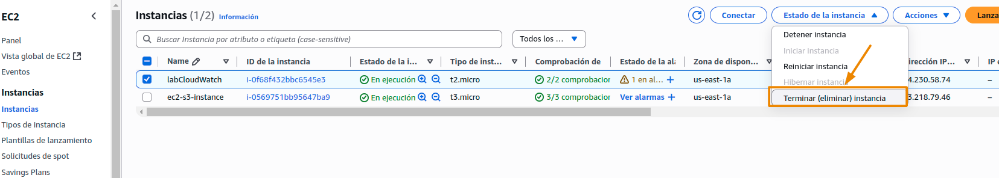


#### En SNS

Vamos a eliminar y confirmar

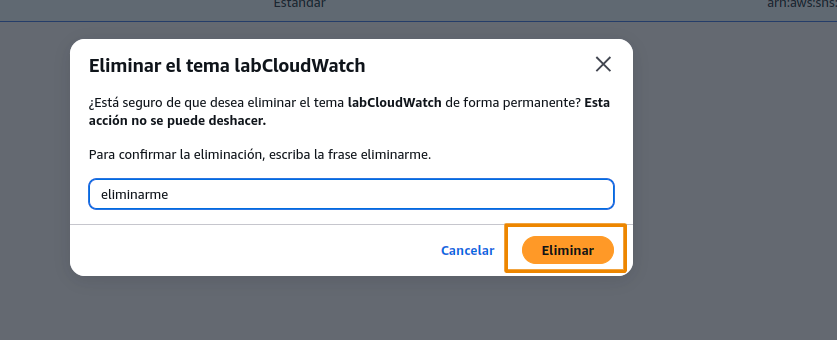


Con los procesos anteriores hemos limpiado todos nuestros recursos


## Referencias 
- [AWS imersion day](https://catalog.workshops.aws/general-immersionday/en-US/basic-modules/40-monitoring/monitoring)