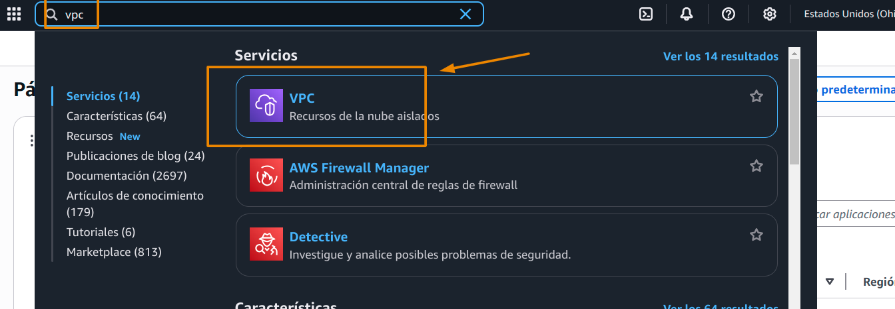

# Como motar tu VPC con tus recursos

## 1. Arquitectura

## 2. Definicion

Vamos a tener dos recursos de computo (ec2) establecidos en dos redes independientes, una publica y otra privada, crearemos nuestra tabla de rutas y lo expondremos con un internet gateway

### 2.1 Servicios

- EC2: Servicio de amazon para computo [ver más](https://aws.amazon.com/es/ec2/)
- VPC: red virtual privada para tener una segmentación logica (en red) de nuestros servicios [ver más](https://aws.amazon.com/es/vpc/). Adicional tambien cuenta con varias funcionalidades que nos permiten realizar lo que necesitamos
    - Route tables
    - Internet Gateway
    - Sub nets
### 2.2 Costo

## 3. Proceso 

### 1. Crearemos nuestra  VPC

Vamos al buscador y escribiremos vpc
