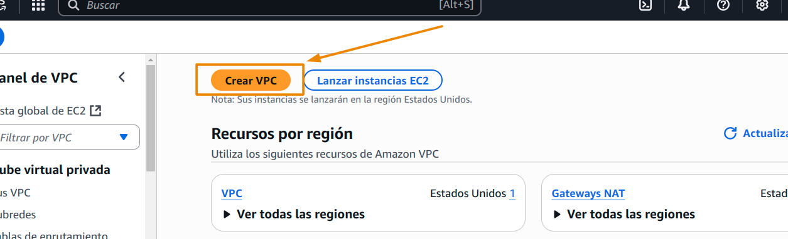
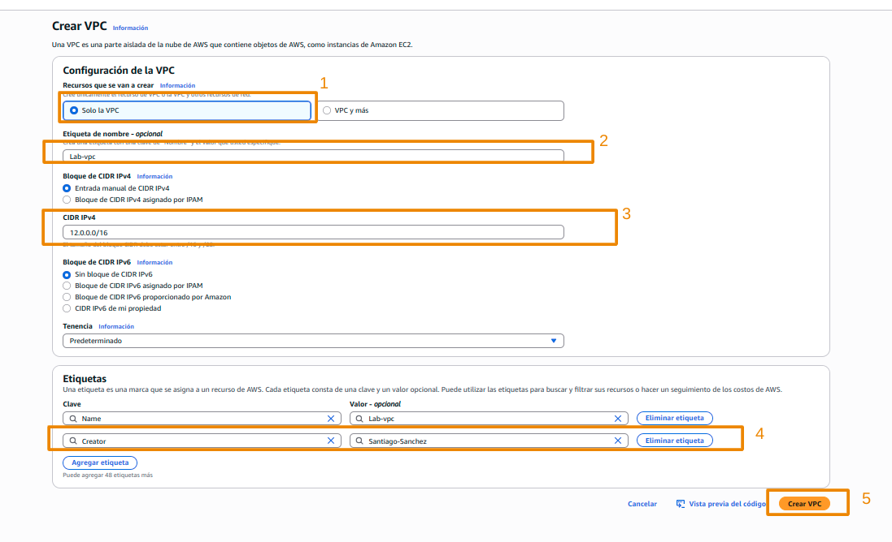
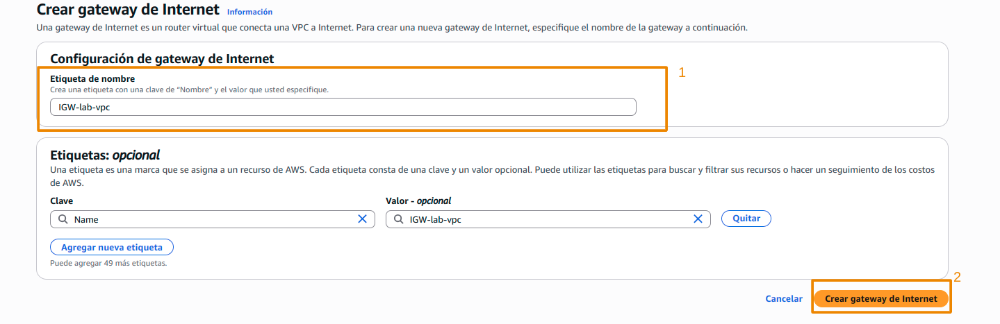
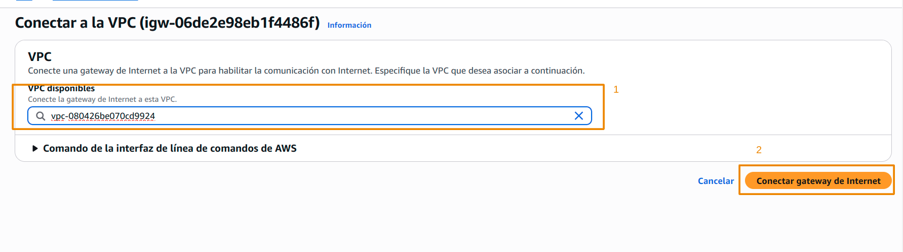

# Como motar tu VPC con tus recursos

## 1. Arquitectura

## 2. Definicion

Vamos a tener dos recursos de computo (ec2) establecidos en dos redes independientes, una publica y otra privada, crearemos nuestra tabla de rutas y lo expondremos con un internet gateway

### 2.1 Servicios

- EC2: Servicio de amazon para computo [ver más](https://aws.amazon.com/es/ec2/)
- VPC: red virtual privada para tener una segmentación logica (en red) de nuestros servicios [ver más](https://aws.amazon.com/es/vpc/). Adicional tambien cuenta con varias funcionalidades que nos permiten realizar lo que necesitamos
    - Route tables
    - Internet Gateway
    - Sub nets
### 2.2 Costo

## 3. Proceso 

### 3.1 Crearemos nuestra  VPC
    
Vamos al buscador y escribiremos vpc, y navegaremos a este servicio

Nota: _Por defecto siempre exite una vpc que es la que se crea cuando creas tu cuenta en AWS_

Luego daremos click en crear el servicio

Luego haremos 5 pasos

1. Seleccionamos solo vpc
2. Colocamos una etiqueta a nuestra VPC
3. Colocaremos el rango de ips para nuestra VPC
4. Agregamos la etiqueta de creador (opcional)
5. Crearemos la VPC

Deberia verse una pantalla como la siguiente

### 3.2 Crearemos nuestro Internet Gateway

Ahora crearemos nuestro intenert gateway; en el panel lateral nos iremos a internet gateway o puertas de enlace de internet

Estableceremos una etiqueta en nuestro internetGateway  y lo crearemos

Deberiamos ver una pantalla como la siguiente

ahora algo  **Importante**, tenemos nuesotro gateway... pero hay que asociarlo, actualmente solo existe

Navegamos a nustra vpc y le damos click en opciones y asociar a vpc

Escogemos nuestra VPC y la asociamos

Luego deberiamos poder ver el proceso de la gateway atada correctamente

### 3.3 Creacion de sub redes